<div align="center">

# 🚀 Crypto Viewer - Advanced Cryptocurrency Analysis

### *Professional Cryptocurrency Analysis Platform with Advanced Technical Analysis and AI*

[](https://python.org)
[](https://fastapi.tiangolo.com)
[](https://nextjs.org)
[](https://typescriptlang.org)
[](LICENSE)
[]()


[🚀 Quick Installation](#-quick-installation) • [📊 Features](#-complete-features) • [🎥 Demo](#-video-demonstration) • [📖 Documentation](#-api-documentation)

---

### 🎯 **What is Crypto Viewer?**

**Complete** and **professional** cryptocurrency analysis system with:
- ✅ **1000+ cryptocurrencies** monitored in real-time
- ✅ **38 advanced analysis tools** (20 basic + 18 professional)
- ✅ **Automatic detection** of candlestick patterns
- ✅ **Paper Trading** to simulate real trades
- ✅ **Alternative charts** (Renko, Kagi, Point & Figure, Heikin-Ashi)
- ✅ **Smart caching** for optimized performance

</div>

---

## 🎥 Video Demonstration

<div align="center">

### 🖥️ **Complete Platform Walkthrough**

[](https://youtu.be/Eeu1xYTih6I)

**👆 Click to watch the full demonstration video**

See all 38 analysis tools in action!

</div>

---

## 📸 Screenshots - Complete Interface

### 🏠 **Main Dashboard & Overview**

<p align="center">
  
  <br/>
  <br/><i>Main dashboard with 100+ cryptocurrencies and key features overview</i>
</p>

<p align="center">
  
  <br/>
  <br/><i>Live market feed with real-time trades and price updates</i>
</p>

<p align="center">
  
  <br/>
  <br/><i>Performance heatmap showing crypto categories performance</i>
</p>

<p align="center">
  
  <br/>
  <br/><i>Top gaining and losing cryptocurrencies with market data</i>
</p>

<p align="center">
  
  <br/>
  <br/><i>Normalized performance comparison between multiple cryptocurrencies</i>
</p>

---

### 📊 **Technical Analysis & Charts**

<p align="center">
  
  <br/>
  <i>Select from 100+ cryptocurrencies for technical analysis</i>
</p>

<p align="center">
  
  <br/>
  <i>Advanced candlestick chart with volume analysis and indicators</i>
</p>

<p align="center">
  
  <br/>
  <i>RSI, MACD, Bollinger Bands and other technical indicators</i>
</p>

---

### 🏅 **Rankings & Categories**

<p align="center">
  
  <br/>
  <i>Detailed rankings with market cap, volume and price data</i>
</p>

<p align="center">
  
  <br/>
  <i>Interactive heatmap of crypto categories performance</i>
</p>

<p align="center">
  
  <br/>
  <i>Detailed breakdown of performance by category</i>
</p>

<p align="center">
  
  <br/>
  <i>Normalized performance comparison tool</i>
</p>

---

### 🎯 **Advanced Technical Analysis Suite**

<p align="center">
  
  <br/>
  <i>Advanced technical analysis overview with score and signals</i>
</p>

<p align="center">
  
  <br/>
  <i>Automatic pivot points calculation (R1, R2, R3, S1, S2, S3)</i>
</p>

<p align="center">
  
  <br/>
  <i>Volume Profile with Point of Control (POC) analysis</i>
</p>

<p align="center">
  
  <br/>
  <i>Money Flow Index (MFI) and Average Directional Index (ADX)</i>
</p>

<p align="center">
  
  <br/>
  <i>Automatic Fibonacci retracements and Camarilla points</i>
</p>

<p align="center">
  
  <br/>
  <i>Fibonacci extensions and Camarilla support/resistance levels</i>
</p>

---

### 📈 **Alternative Chart Types**

<p align="center">
  
  <br/>
  <i>Renko charts - Filters noise, showing only significant price movements</i>
</p>

<p align="center">
  
  <br/>
  <i>Kagi charts - Focuses on significant reversals</i>
</p>

<p align="center">
  
  <br/>
  <i>Point & Figure - Uses X (up) and O (down) to represent movements</i>
</p>

<p align="center">
  
  <br/>
  <i>Range Bars - Creates bars based on price range, not time</i>
</p>

---

### 🔬 **Advanced Analysis Tools**

<p align="center">
  
  <br/>
  <i>20+ professional analyses for intelligent trading decisions</i>
</p>

<p align="center">
  
  <br/>
  <i>Multi-Indicator Consensus - Aggregates signals from multiple indicators</i>
</p>

<p align="center">
  
  <br/>
  <i>Breakout Scanner with Mean Reversion analysis</i>
</p>

<p align="center">
  
  <br/>
  <i>Swing Trading Signals and Trade Planner with entry zones</i>
</p>

<p align="center">
  
  <br/>
  <i>Entry Confirmation Checklist - Validates trade setups with 6 criteria</i>
</p>

<p align="center">
  
  <br/>
  <i>Price Action Patterns and Divergences detection</i>
</p>

<p align="center">
  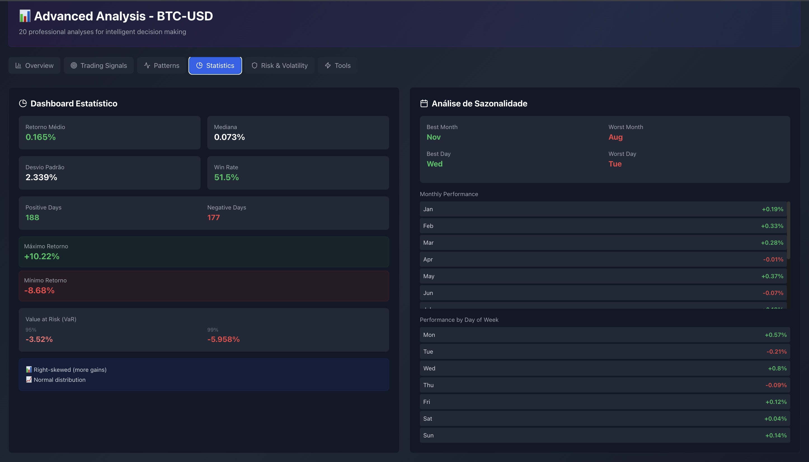
  <br/>
  <i>Statistical Dashboard with seasonality analysis</i>
</p>

<p align="center">
  
  <br/>
  <i>Anomaly Detection - Identifies unusual price/volume behavior</i>
</p>

<p align="center">
  
  <br/>
  <i>Volatility Analysis and Advanced Support/Resistance levels</i>
</p>

<p align="center">
  
  <br/>
  <i>Dollar-Cost Averaging Simulator and Fibonacci Time Zones</i>
</p>

---

### 🏆 **Professional Trading Tools**

<p align="center">
  
  <br/>
  <i>Ichimoku Cloud System - Complete Japanese technical analysis with cloud signals</i>
</p>

<p align="center">
  
  <br/>
  <i>Wyckoff Method Analysis and Support & Resistance Zones detection</i>
</p>

<p align="center">
  
  <br/>
  <i>Elliott Wave Counter with Candlestick Pattern Library detection</i>
</p>

<p align="center">
  
  <br/>
  <i>Confluence Detector - Identifies price levels with multiple indicator convergence</i>
</p>

<p align="center">
  
  <br/>
  <i>Technical Setup Finder - Automatically detects trading setups</i>
</p>

<p align="center">
  
  <br/>
  <i>Reversal Probability Calculator - Predicts reversal likelihood</i>
</p>

<p align="center">
  
  <br/>
  <i>Monte Carlo Simulation - 1000 runs with 30-day price projections</i>
</p>

<p align="center">
  
  <br/>
  <i>Historical Performance Calendar and Drawdown Analysis by month</i>
</p>

<p align="center">
  
  <br/>
  <i>Detailed Drawdown Analysis with historical drawdown periods</i>
</p>

<p align="center">
  
  <br/>
  <i>Win Rate by Day of Week - Identifies best trading days</i>
</p>

<p align="center">
  
  <br/>
  <i>Acceleration Indicator and Volume Momentum analysis</i>
</p>

<p align="center">
  
  <br/>
  <i>Volume Momentum and Price Velocity Gauge analysis</i>
</p>

<p align="center">
  
  <br/>
  <i>Position Sizing Calculator - Risk management with R:R scenarios</i>
</p>

<p align="center">
  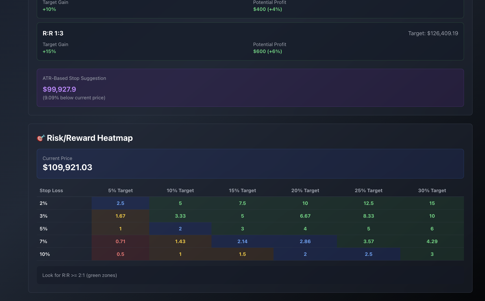
  <br/>
  <i>Risk/Reward Heatmap - Visual matrix for different stop loss and target combinations</i>
</p>

---

### 🛠️ **Advanced Tools**

<p align="center">
  
  <br/>
  <i>Paper Trading Simulator - Practice trading with $100,000 virtual capital</i>
</p>

<p align="center">
  
  <br/>
  <i>Execute Buy orders with real-time price updates</i>
</p>

<p align="center">
  
  <br/>
  <i>Execute Sell orders and manage positions</i>
</p>

<p align="center">
  
  <br/>
  <i>Complete trading history with Cryptocurrency Screener</i>
</p>

<p align="center">
  
  <br/>
  <i>Advanced Crypto Comparator - Return vs Risk (Volatility) analysis</i>
</p>

<p align="center">
  
  <br/>
  <i>Interactive hover showing detailed metrics for each cryptocurrency</i>
</p>

<p align="center">
  
  <br/>
  <i>Detailed comparison table with Return, Volatility, Sharpe, Beta, Max DD and RSI</i>
</p>

<p align="center">
  
  <br/>
  <i>Interactive Correlation Heatmap between cryptocurrencies</i>
</p>

<p align="center">
  
  <br/>
  <i>Correlation Network Graph showing strong connections between cryptos</i>
</p>

<p align="center">
  
  <br/>
  <i>Market Cap Treemap by Sector - Layer 1 Blockchains, Stablecoins, Exchange Tokens</i>
</p>

<p align="center">
  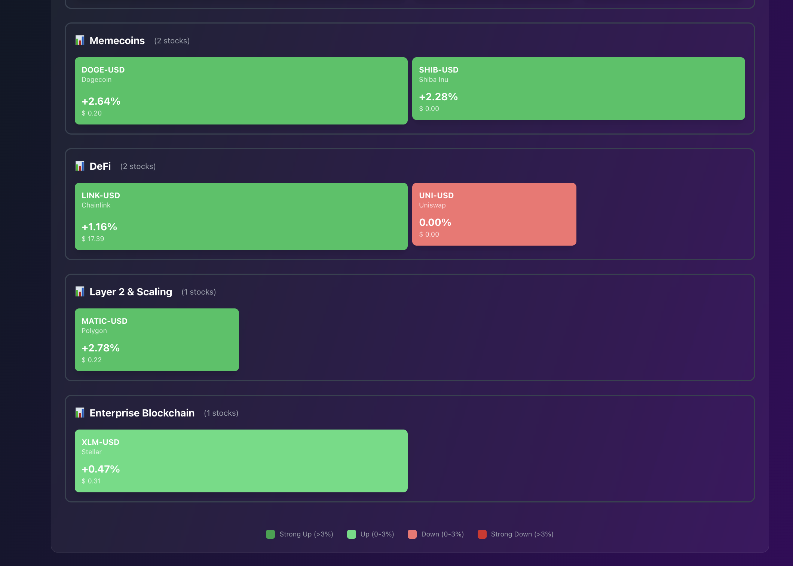
  <br/>
  <i>Detailed view showing Memecoins, DeFi, Layer 2 & Scaling sectors</i>
</p>


---

## 📊 Complete Features

### 🎯 **Dashboard & Overview**
- 📊 **Real-time Market Data** - 1000+ cryptocurrencies monitored
- 📈 **Live Market Feed** - Real-time trades and price updates
- 🔥 **Top Gainers & Losers** - Biggest movers of the day
- 🗂️ **Category Performance** - Performance by sector (DeFi, Layer 1, Memecoins, etc.)
- 📉 **Normalized Comparison** - Compare multiple cryptos on same scale

### 📊 **Technical Analysis (Basic)**
1. **Technical Score** - Automated 0-100 score with buy/sell recommendations
2. **Interactive Charts** - Candlestick, line, and bar charts with zoom
3. **Support & Resistance** - Automatic calculation of key price levels
4. **Pivot Points** - Classic, Fibonacci, Camarilla, and Woodie pivots
5. **Volume Profile** - Point of Control (POC) and high/low volume nodes
6. **Candlestick Patterns** - 30+ patterns (doji, hammer, engulfing, etc.)
7. **Technical Indicators** - RSI, MACD, Bollinger Bands, Stochastic, ATR, ADX, MFI, OBV, CCI, Williams %R, ROC
8. **Moving Averages** - SMA, EMA (20, 50, 100, 200 periods)
9. **Fibonacci Retracements** - Automatic 23.6%, 38.2%, 50%, 61.8%, 78.6% levels
10. **Fibonacci Extensions** - 127.2%, 161.8%, 261.8% projection levels

### 📈 **Alternative Chart Types**
11. **Renko Charts** - Noise-filtered charts showing only significant moves
12. **Kagi Charts** - Reversal-based charts independent of time
13. **Point & Figure** - X and O charts for trend identification
14. **Heikin-Ashi** - Smoothed candlesticks for clearer trends
15. **Range Bars** - Price range-based bars (not time-based)

### 🎯 **Advanced Analysis (20 Tools)**
16. **Multi-Indicator Consensus** - Aggregates 15+ indicators into single signal
17. **Breakout Scanner** - Identifies cryptos near resistance levels
18. **Mean Reversion** - Detects overbought/oversold conditions
19. **Swing Trading Signals** - Entry/exit signals for swing traders
20. **Visual Trade Planner** - Plan entries, stop-loss, and take-profit levels
21. **Entry Confirmation Checklist** - 6-point validation system
22. **Price Action Patterns** - Head & shoulders, triangles, flags, wedges
23. **Divergences Detection** - RSI/MACD divergences (bullish/bearish)
24. **Statistical Dashboard** - Distribution, volatility, correlation metrics
25. **Seasonality Analysis** - Historical performance by month/day
26. **Anomaly Detection** - Unusual price/volume behavior alerts
27. **Fast Movers Alert** - Rapid price movement tracking
28. **Volatility Analysis** - ATR, Bollinger Bands width, historical volatility
29. **Advanced Support/Resistance** - Fibonacci, psychological levels, clustering
30. **DCA Simulator** - Dollar-Cost Averaging strategy simulation
31. **Fibonacci Time Zones** - Time-based Fibonacci projections
32. **Gap Analysis** - Price gap detection and fill probability
33. **Watchlist Comparison** - Compare multiple cryptos side-by-side
34. **Risk Assessment** - Volatility, drawdown, and Sharpe ratio analysis
35. **Custom Alerts** - Price, volume, and indicator-based alerts

### 🏆 **Professional Tools (18 Tools)**
36. **Ichimoku Cloud** - Complete Japanese analysis system (Tenkan, Kijun, Senkou, Chikou)
37. **Elliott Wave** - Wave pattern identification and counting
38. **Wyckoff Method** - Accumulation/distribution phase analysis
39. **Trend Alignment** - Multi-timeframe trend confirmation
40. **Candlestick Pattern Library** - 20+ patterns with reliability scores
41. **Confluence Detector** - Identifies levels with multiple indicator convergence
42. **Technical Setup Finder** - Pre-configured setups (breakout, pullback, reversal)
43. **Reversal Probability** - Statistical likelihood of trend reversal
44. **Monte Carlo Simulation** - 1000 runs with 30-day price projections
45. **Performance Calendar** - Historical returns by month (heatmap)
46. **Drawdown Analysis** - Maximum drawdown and recovery periods
47. **Win Rate by Day** - Best trading days and hours analysis
48. **Acceleration Indicator** - Price velocity and acceleration metrics
49. **Volume Momentum** - Volume trends and price-volume correlation
50. **Price Velocity Gauge** - Speed classification across timeframes
51. **Position Sizing Calculator** - Risk-based position calculation (Kelly, fixed %, etc.)
52. **Risk/Reward Heatmap** - Visual matrix of R:R scenarios
53. **Order Flow Analysis** - Buy/sell pressure and volume delta

### 🛠️ **Advanced Tools & Utilities**
54. **Paper Trading** - Simulate trades with $100,000 virtual capital
55. **Portfolio Tracker** - Track positions, P&L, and performance
56. **Cryptocurrency Screener** - Filter cryptos by 20+ criteria
57. **Crypto Comparator** - Return vs Risk scatter plot analysis
58. **Correlation Heatmap** - Correlation matrix between cryptos
59. **Correlation Network** - Visual network of strong correlations
60. **Market Cap Treemap** - Sector visualization by market capitalization

### 🚀 **Performance & Quality**
- ⚡ **Smart Caching** - 2-5 minute TTL for optimal performance
- 🔄 **Real-time Updates** - Live price and volume data
- 📱 **Responsive Design** - Works on desktop, tablet, and mobile
- 🎨 **Modern UI** - Beautiful interface with smooth animations
- 🔒 **No API Keys Required** - Uses free Yahoo Finance data
- 📊 **Export Data** - Download analysis results as CSV/JSON

---

## 🏗️ System Architecture

```mermaid
graph TB
    subgraph "Frontend - Next.js 14"
        A[🖥️ React Interface] --> B[📊 Chart Components]
        B --> C[⚡ Lightweight Charts]
        B --> D[📈 Recharts]
        A --> E[🎨 Tailwind CSS]
        A --> F[🌊 Framer Motion]
    end
    
    subgraph "Backend - FastAPI"
        G[🔌 REST API] --> H[💾 Cache Service]
        G --> I[📡 Crypto Data Service]
        I --> J[📊 Technical Analysis]
        I --> K[🧪 Paper Trading]
        I --> L[🔍 Pattern Recognition]
    end
    
    subgraph "Data Sources"
        M[📊 Yahoo Finance API]
        N[🪙 Cryptocurrency Market Data]
    end
    
    A -->|HTTP/REST| G
    I -->|Fetch Data| M
    I -->|Market Info| N
    H -->|TTL 2-5min| I
    
    style A fill:#3b82f6,stroke:#1e40af,stroke-width:3px,color:#fff
    style G fill:#10b981,stroke:#059669,stroke-width:3px,color:#fff
    style H fill:#f59e0b,stroke:#d97706,stroke-width:3px,color:#fff
    style I fill:#8b5cf6,stroke:#7c3aed,stroke-width:3px,color:#fff
    style M fill:#ef4444,stroke:#dc2626,stroke-width:2px,color:#fff
    style N fill:#06b6d4,stroke:#0891b2,stroke-width:2px,color:#fff
```

---

## ⚡ Smart Caching System

```mermaid
sequenceDiagram
    participant U as 👤 User
    participant F as 🖥️ Frontend
    participant API as 🔌 API
    participant Cache as 💾 Cache
    participant YF as 📊 Yahoo Finance
    
    rect rgb(34, 197, 94)
        Note over U,YF: 🎯 First Request (Empty Cache)
        U->>F: Opens Dashboard
        F->>API: GET /api/crypto/ranking
        API->>Cache: Search 'ranking_change'
        Cache-->>API: ❌ Not found
        API->>YF: Fetch cryptocurrency data
        Note over API,YF: ⏳ ~5-10s
        YF-->>API: Returns data
        API->>Cache: 💾 Save (TTL: 2min)
        API-->>F: ✅ Data
        F-->>U: 📊 Display charts
    end
    
    rect rgb(59, 130, 246)
        Note over U,YF: 🚀 Subsequent Requests (Active Cache)
        U->>F: Refreshes page
        F->>API: GET /api/crypto/ranking
        API->>Cache: Search 'ranking_change'
        Cache-->>API: ✅ Found! (valid)
        Note over Cache: ⚡ Instant (< 50ms)
        API-->>F: ✅ Data from cache
        F-->>U: 📊 INSTANT display
    end
    
    rect rgb(249, 115, 22)
        Note over U,YF: 🔄 Expired Cache (After 2min)
        U->>F: New request
        F->>API: GET /api/crypto/ranking
        API->>Cache: Search 'ranking_change'
        Cache-->>API: ⌛ Expired
        Note over Cache: 🧹 Remove old cache
        API->>YF: Fetch new data
        YF-->>API: Updated data
        API->>Cache: 💾 Save new cache
        API-->>F: ✅ Updated data
        F-->>U: 📊 Display
    end
```

**Result:** 
- ⚡ **100x faster** after first load
- 💰 **Resource saving** (fewer API calls)
- 🎯 **Recent data** (max delay of 2-5 minutes)

---

## 📊 Complete Features

### 🎯 **1. Market Overview**
```mermaid
graph LR
    A[📊 Crypto Real-Time] --> B[📈 1000+ coins]
    C[🏢 Market Cap] --> D[🚀 Rankings]
    E[📉 Top Gainers] --> F[⬆️ Top 20]
    G[📉 Top Losers] --> H[⬇️ Bottom 20]
    I[💹 Live Feed] --> J[🔍 Updates]
    
    style A fill:#10b981,color:#fff
    style B fill:#22c55e,color:#fff
    style C fill:#3b82f6,color:#fff
    style D fill:#60a5fa,color:#fff
    style E fill:#f59e0b,color:#fff
    style F fill:#fbbf24,color:#fff
    style G fill:#ef4444,color:#fff
    style H fill:#f87171,color:#fff
    style I fill:#8b5cf6,color:#fff
    style J fill:#a78bfa,color:#fff
```

**Features:**
- 📊 Real-time cryptocurrency tracking
- 🏆 Ranking of top 20 gainers and top 20 losers
- 🎨 Market heatmap with dynamic colors
- 💹 1000+ cryptocurrencies available
- ⚡ Automatic updates with smart caching

---

### 📈 **2. Technical Analysis (30+ Indicators)**

```mermaid
graph TD
    A[📊 Technical Analysis] --> B[📈 Trend]
    A --> C[🎯 Momentum]
    A --> D[📉 Volatility]
    A --> E[💰 Volume]
    A --> F[🔮 Fibonacci]
    
    B --> B1[SMA, EMA, MACD, ADX]
    C --> C1[RSI, Stochastic, ROC]
    D --> D1[Bollinger, ATR, Keltner]
    E --> E1[OBV, MFI, VWAP]
    F --> F1[Retracements, Extensions]
    
    style A fill:#8b5cf6,color:#fff
    style B fill:#3b82f6,color:#fff
    style C fill:#10b981,color:#fff
    style D fill:#f59e0b,color:#fff
    style E fill:#ef4444,color:#fff
    style F fill:#ec4899,color:#fff
```

**30+ Technical Indicators:**

| Category | Indicators | Description |
|----------|-------------|-----------|
| 📊 **Trend** | SMA, EMA, MACD, ADX | Identifies market direction |
| 🎯 **Momentum** | RSI, Stochastic, ROC, Force Index | Measures strength of movements |
| 📉 **Volatility** | Bollinger Bands, ATR, Keltner | Evaluates price oscillations |
| 💰 **Volume** | OBV, MFI, VWAP, AD Line | Analyzes money flow |
| 🔮 **Fibonacci** | Retracements, Extensions, Pivots | Support/resistance levels |

---

### 🧪 **3. Paper Trading - Investment Simulator**


**Features:**
- 💰 Initial balance of **$100,000**
- 📊 Buy/sell with **real prices** from Yahoo Finance
- 📈 Real-time **profit/loss** tracking
- 📋 Complete history of **all operations**
- 🔄 Reset portfolio anytime
- 🎯 **Zero risk** - virtual money!

---

### 📊 **4. Alternative Charts**

```mermaid
graph TD
    A[📊 Chart Types] --> B[🧱 Renko Charts]
    A --> C[📐 Kagi Charts]
    A --> D[⬜ Point & Figure]
    A --> E[🕯️ Heikin-Ashi]
    
    B --> B1[Filters noise<br/>Focus on price movement]
    C --> C1[Emphasizes reversals<br/>Thick/thin lines]
    D --> D1[X's and O's<br/>Supply/demand]
    E --> E1[Smoothed candlesticks<br/>Trend clarity]
    
    style A fill:#8b5cf6,color:#fff
    style B fill:#3b82f6,color:#fff
    style C fill:#10b981,color:#fff
    style D fill:#f59e0b,color:#fff
    style E fill:#ef4444,color:#fff
```

**Chart Types:**
- 🧱 **Renko**: Filters out time and focuses purely on price movement
- 📐 **Kagi**: Emphasizes trend reversals with thick/thin lines
- ⬜ **Point & Figure**: Uses X's and O's to show supply and demand
- 🕯️ **Heikin-Ashi**: Smoothed candlesticks for better trend identification

---

### 🎯 **5. Advanced Analysis (20 Tools)**

```mermaid
graph LR
    A[🎯 Advanced Analysis] --> B[📊 Breakout Scanner]
    A --> C[📈 Swing Signals]
    A --> D[🎨 Price Action]
    A --> E[📉 Statistics]
    A --> F[🔍 Anomaly Detection]
    A --> G[🎯 Multi-Indicator]
    A --> H[📋 Watchlist Matrix]
    A --> I[🎨 Trade Planner]
    A --> J[⚡ Fast Movers]
    A --> K[💰 DCA Simulator]
    
    style A fill:#8b5cf6,color:#fff
    style B fill:#3b82f6,color:#fff
    style C fill:#10b981,color:#fff
    style D fill:#f59e0b,color:#fff
    style E fill:#ef4444,color:#fff
    style F fill:#ec4899,color:#fff
    style G fill:#06b6d4,color:#fff
    style H fill:#14b8a6,color:#fff
    style I fill:#f97316,color:#fff
    style J fill:#84cc16,color:#fff
    style K fill:#eab308,color:#fff
```

**20 Advanced Tools:**
1. 📊 **Breakout Scanner** - Identifies cryptos near resistance
2. 📈 **Swing Trading Signals** - Optimal swing opportunities
3. 🎨 **Price Action Patterns** - Classic chart patterns
4. 📉 **Statistical Dashboard** - Comprehensive statistics
5. 🔍 **Anomaly Detection** - Unusual price/volume behavior
6. 🎯 **Multi-Indicator Consensus** - 15+ indicators aggregated
7. 📋 **Watchlist Comparison** - Side-by-side comparison
8. 🎨 **Visual Trade Planner** - Interactive planning
9. ⚡ **Fast Movers Alert** - Rapid price changes
10. 💰 **DCA Simulator** - Dollar-cost averaging strategy
11. ✅ **Entry Checklist** - 10-point trade validation
12. 🔮 **Fibonacci Time Zones** - Time-based projections
13. 📉 **Gap Analysis** - Price gap detection
14. 📊 **Divergences Detection** - Bullish/bearish divergences
15. 🎯 **Advanced S/R** - Support/resistance zones
16. 📈 **Momentum MTF** - Multi-timeframe momentum
17. 🏆 **Relative Strength** - Ranking by strength
18. 📉 **Mean Reversion** - Z-score analysis
19. 📅 **Seasonality** - Calendar analysis
20. 📊 **Volatility Expanded** - Deep volatility metrics

---

### 🏆 **6. Professional Tools (18 Tools)**

```mermaid
graph TB
    A[🏆 Professional Tools] --> B[📈 Technical]
    A --> C[🎯 Patterns]
    A --> D[📊 Statistics]
    A --> E[⚡ Momentum]
    A --> F[🛡️ Risk]
    
    B --> B1[Ichimoku Cloud<br/>Elliott Wave<br/>Wyckoff<br/>Trend Alignment]
    C --> C1[Candlestick Library<br/>Technical Setups<br/>S/R Zones]
    D --> D1[Monte Carlo<br/>Calendar<br/>Drawdown<br/>Win Rate<br/>Confluence]
    E --> E1[Reversal Probability<br/>Acceleration<br/>Volume Momentum<br/>Velocity]
    F --> F1[Position Sizing<br/>Risk/Reward]
    
    style A fill:#8b5cf6,color:#fff
    style B fill:#3b82f6,color:#fff
    style C fill:#10b981,color:#fff
    style D fill:#f59e0b,color:#fff
    style E fill:#ef4444,color:#fff
    style F fill:#ec4899,color:#fff
```

#### **📈 Technical Analysis (4 tools)**
- ☁️ **Ichimoku Cloud** - Complete Japanese technical system
- 🌊 **Elliott Wave** - Wave pattern identification
- 🎯 **Wyckoff Method** - Smart money analysis
- 📊 **Trend Alignment** - Multi-timeframe alignment

#### **🎯 Patterns & Setups (3 tools)**
- 🕯️ **Candlestick Library** - 20+ patterns
- 🔍 **Technical Setups** - Pre-configured setups
- 🎯 **S/R Zones** - Automatic detection

#### **📊 Statistics & Probability (5 tools)**
- 🎲 **Monte Carlo** - 30-day simulations
- 📅 **Performance Calendar** - Historical returns
- 📉 **Drawdown Analysis** - Peak-to-trough decline
- 🕒 **Win Rate** - Best days/hours
- 🎯 **Confluence Detector** - Multiple factors align

#### **⚡ Momentum & Velocity (4 tools)**
- 🔄 **Reversal Probability** - Trend reversal likelihood
- 🚀 **Acceleration** - Velocity & acceleration
- 📊 **Volume Momentum** - Volume trends
- ⚡ **Velocity Gauge** - Speed classification

#### **🛡️ Risk Management (2 tools)**
- 💰 **Position Sizing** - Risk-based calculation
- 📊 **Risk/Reward** - Visual heatmap

---

### 🔍 **7. Crypto Screener**

```mermaid
graph LR
    A[🔍 Screener] --> B[💰 Price Filter]
    A --> C[📊 Volume Filter]
    A --> D[📈 Change % Filter]
    A --> E[🎯 Score Filter]
    A --> F[📉 Technical Filter]
    
    B --> G[Results]
    C --> G
    D --> G
    E --> G
    F --> G
    
    G --> H[📊 Export CSV]
    G --> I[📈 View Charts]
    G --> J[🎯 Add to Watchlist]
    
    style A fill:#8b5cf6,color:#fff
    style G fill:#10b981,color:#fff
```

**Features:**
- 💰 Filter by **price range**
- 📊 Filter by **volume**
- 📈 Filter by **% change** (24h, 7d, 30d)
- 🎯 Filter by **technical score** (0-100)
- 📉 Filter by **indicators** (RSI, MACD, etc.)
- 📊 **Export results** to CSV
- 📈 **Real-time updates**

---

## 🚀 Quick Installation

### **Prerequisites**

- **Python 3.11+**
- **Node.js 18+** and npm
- **Git**

### **Step 1: Clone the Repository**

```bash
git clone https://github.com/gregorizeidler/crypto-viewer.git
cd crypto-viewer
```

### **Step 2: Backend Setup (FastAPI)**

```bash
# Create virtual environment
python -m venv venv

# Activate virtual environment
# On macOS/Linux:
source venv/bin/activate
# On Windows:
venv\Scripts\activate

# Install dependencies
pip install -r requirements.txt

# Start backend server
cd crypto-viewer
python -m uvicorn app.api.main:app --host 0.0.0.0 --port 8000 --reload
```

Backend will be available at: **http://localhost:8000**

### **Step 3: Frontend Setup (Next.js)**

```bash
# Open new terminal
cd crypto-viewer/frontend

# Install dependencies
npm install

# Start development server
npm run dev
```

Frontend will be available at: **http://localhost:3000**

### **Step 4: Access the Application**

Open your browser and navigate to:
- **Frontend**: http://localhost:3000
- **API Documentation**: http://localhost:8000/docs

### **🐳 Quick Start with Script**

```bash
chmod +x start_dashboard.sh
./start_dashboard.sh
```

---

## 📁 Project Structure

```
crypto-viewer/
│
├── app/                              # Backend (FastAPI)
│   ├── api/
│   │   └── main.py                   # Main API routes
│   │
│   └── services/
│       ├── cache_service.py          # Smart caching
│       ├── crypto_data_service.py    # Data fetching
│       ├── market_feed_service.py    # Real-time feed
│       ├── paper_trading_service.py  # Paper trading
│       ├── technical_analysis_advanced.py
│       ├── advanced_analysis_service.py    # 20 tools
│       └── professional_tools_service.py   # 18 tools
│
├── frontend/                         # Frontend (Next.js 14)
│   ├── src/
│   │   ├── app/
│   │   │   ├── page.tsx              # Main dashboard
│   │   │   ├── analise-avancada/
│   │   │   │   └── page.tsx          # Advanced analysis
│   │   │   └── professional-tools/
│   │   │       └── page.tsx          # Professional tools
│   │   │
│   │   ├── components/
│   │   │   ├── CryptoChart.tsx
│   │   │   ├── CryptoRanking.tsx
│   │   │   ├── LiveMarketFeed.tsx
│   │   │   ├── PaperTrading.tsx
│   │   │   ├── AdvancedAnalysis.tsx
│   │   │   └── ProfessionalTools.tsx
│   │   │
│   │   └── lib/
│   │       └── api.ts                # API client
│   │
│   └── package.json
│
├── requirements.txt                  # Python dependencies
├── start_dashboard.sh                # Quick start script
└── README.md                         # This file
```

---

## 📖 API Documentation

### **Main Endpoints**

```http
# Cryptocurrency data
GET /api/crypto/chart/{ticker}?period=1mo&interval=1d
GET /api/crypto/ranking?limit=20
GET /api/crypto/technical-score/{ticker}

# Advanced analysis (20 tools)
GET /api/crypto/advanced/breakout-scanner/{ticker}
GET /api/crypto/advanced/swing-signals/{ticker}
GET /api/crypto/advanced/price-action/{ticker}
GET /api/crypto/advanced/statistics/{ticker}
GET /api/crypto/advanced/anomaly-detection/{ticker}
GET /api/crypto/advanced/multi-indicator-consensus/{ticker}
GET /api/crypto/advanced/watchlist-comparison?tickers=BTC-USD,ETH-USD
GET /api/crypto/advanced/trade-planner/{ticker}
GET /api/crypto/advanced/fast-movers?threshold=5
GET /api/crypto/advanced/dca-simulator/{ticker}

# Professional tools (18 tools)
GET /api/professional/ichimoku/{ticker}
GET /api/professional/elliott-wave/{ticker}
GET /api/professional/wyckoff/{ticker}
GET /api/professional/trend-alignment/{ticker}
GET /api/professional/candlestick-patterns/{ticker}
GET /api/professional/support-resistance/{ticker}
GET /api/professional/monte-carlo/{ticker}?days=30
GET /api/professional/calendar/{ticker}?period=2y
GET /api/professional/drawdown/{ticker}
GET /api/professional/win-rate/{ticker}
GET /api/professional/confluence/{ticker}
GET /api/professional/reversal-probability/{ticker}
GET /api/professional/acceleration/{ticker}
GET /api/professional/volume-momentum/{ticker}
GET /api/professional/velocity/{ticker}
GET /api/professional/position-sizing/{ticker}
GET /api/professional/risk-reward/{ticker}
GET /api/professional/technical-setups/{ticker}

# Paper trading
POST /api/paper-trading/buy
POST /api/paper-trading/sell
GET /api/paper-trading/balance
GET /api/paper-trading/positions
GET /api/paper-trading/history
POST /api/paper-trading/reset

# Screener
POST /api/screener/scan
GET /api/screener/presets
```

**Complete documentation:** http://localhost:8000/docs

---

## 🛠️ Technologies Used

### **Backend**
- **FastAPI** - High-performance web framework
- **Python 3.11+** - Programming language
- **yfinance** - Yahoo Finance API wrapper
- **pandas** - Data manipulation
- **numpy** - Numerical computing
- **ta** - Technical analysis library
- **uvicorn** - ASGI server

### **Frontend**
- **Next.js 14** - React framework
- **TypeScript** - Type-safe JavaScript
- **React 18** - UI library
- **Tailwind CSS** - Utility-first CSS
- **Framer Motion** - Animation library
- **Lightweight Charts** - TradingView charts
- **Recharts** - Charting library
- **Lucide React** - Icon library

---

## 🔧 Configuration

Create a `.env` file (optional):

```env
# Backend
BACKEND_HOST=0.0.0.0
BACKEND_PORT=8000
CACHE_TTL_MINUTES=5

# Frontend
NEXT_PUBLIC_API_URL=http://localhost:8000
```

---

## 🐳 Docker Deployment

**docker-compose.yml:**

```yaml
version: '3.8'

services:
  backend:
    build:
      context: .
      dockerfile: Dockerfile.backend
    ports:
      - "8000:8000"
    environment:
      - CACHE_TTL_MINUTES=5
  
  frontend:
    build:
      context: .
      dockerfile: Dockerfile.frontend
    ports:
      - "3000:3000"
    environment:
      - NEXT_PUBLIC_API_URL=http://backend:8000
    depends_on:
      - backend
```

Run with:
```bash
docker-compose up -d
```

---

## 🤝 Contributing

Contributions are welcome! Please follow these steps:

1. Fork the repository
2. Create a feature branch: `git checkout -b feature/amazing-feature`
3. Commit your changes: `git commit -m 'Add amazing feature'`
4. Push to the branch: `git push origin feature/amazing-feature`
5. Open a Pull Request

---

## 📄 License

This project is licensed under the MIT License - see the [LICENSE](LICENSE) file for details.

---

## 🙏 Acknowledgments

- **Yahoo Finance** for providing free financial data API
- **TradingView** for Lightweight Charts library
- **FastAPI** team for the excellent web framework
- **Next.js** team for the React framework
- **Tailwind CSS** for the utility-first CSS framework

---

<div align="center">

### ⭐ If you found this project helpful, please give it a star!

### 🚀 Happy Trading! 📈

</div>
